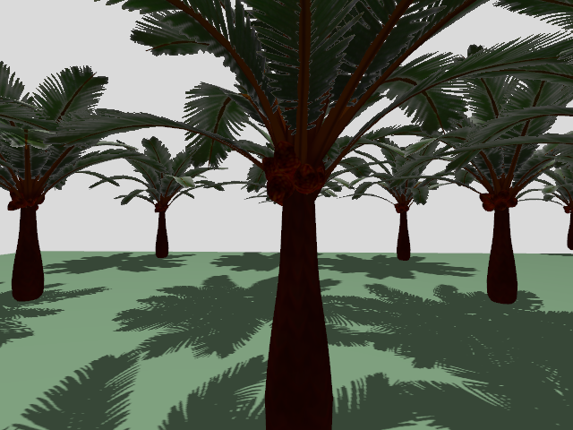
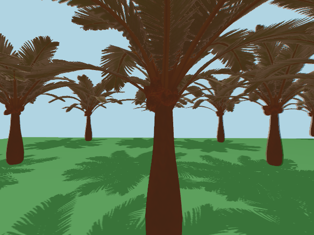
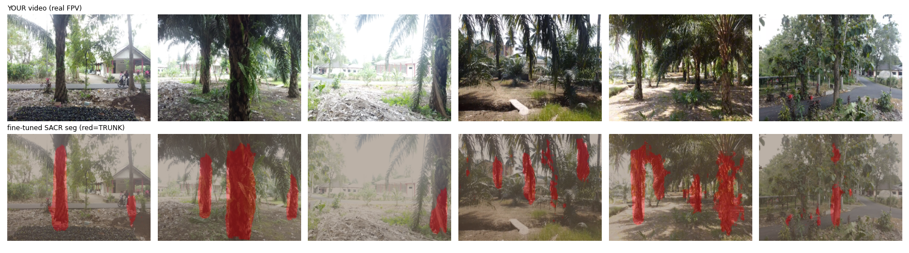
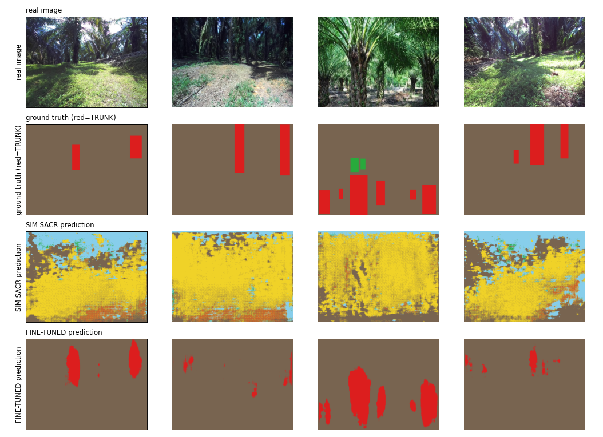
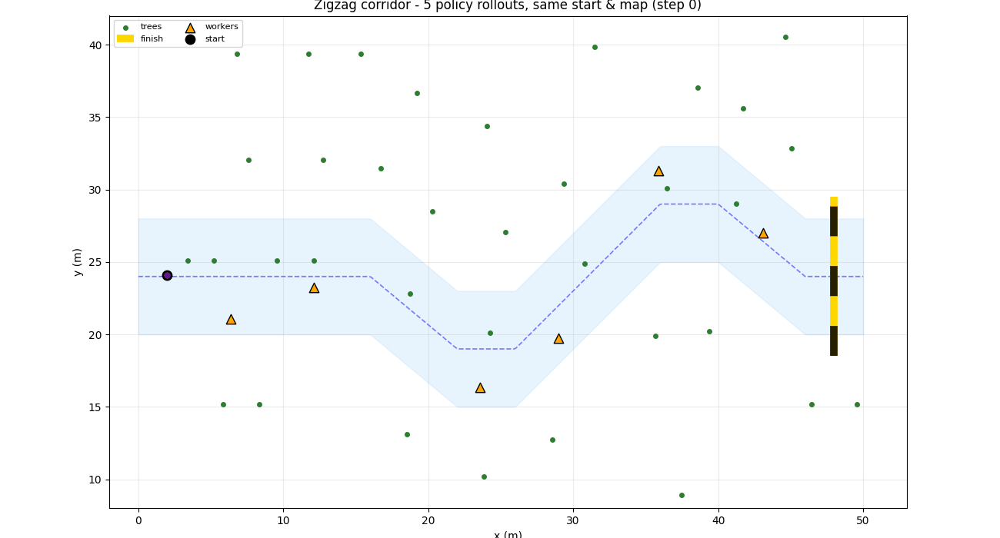
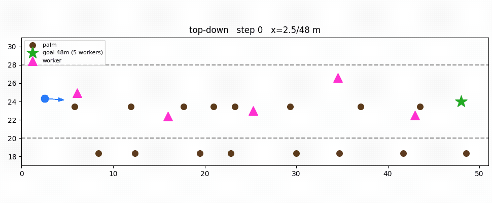

# STAR-Nav: Spatio-Temporal Adaptive Reinforcement Navigation

Official PyTorch implementation of **STAR-Nav**, a monocular-vision navigation
policy for autonomous UAV flight through **GPS-denied, visually repetitive**
environments. The motivating case is an oil-palm plantation, where every row
looks like the last and satellite positioning is unreliable under the canopy.

Paper: *"Spatio-Temporal Adaptive Reinforcement Learning for Autonomous
Monocular UAV Navigation in GPS-Denied Repetitive Environment."*

## Why the problem is hard

A plantation corridor defeats the usual navigation stack in two ways at once:

- **No GPS.** Dense canopy blocks satellite fixes, so absolute position is not
  available to lean on. Localization has to come from vision.
- **Repetition.** Every tree row is near-identical, so a purely reactive policy
  loses track of *where along the corridor* it is. The agent needs memory of
  where it has been, not just what it sees right now.

STAR-Nav answers both with a three-stage pipeline: a perception module that
extracts corridor *structure* rather than raw pixels, a memory module that
integrates that structure over time, and a reinforcement-learned controller
with a geometric safety layer.

## How it works: the pipeline

```
 monocular RGB ──▶ SACR ──▶ CAMR ──▶ AGSS-PPO ──▶ 4-DoF velocity command
                (perception)  (memory)  (control + safety shield)
```

### 1. SACR: Structure-Aware Corridor Representation
*`star_nav/models/sacr.py`, `enet.py`, `depth_net.py` (paper §3.2)*

Turns each camera frame into a compact **structural** descriptor of the
corridor: segmentation of trunks vs. free space, monocular depth, and the
heading/lateral geometry of the lane, instead of passing raw pixels downstream.
This is what makes the policy robust to the visual repetition: two
identical-looking rows produce the same clean structural signal.

### 2. CAMR: Consistency-Aware Memory Representation
*`star_nav/models/camr.py` (paper §3.3)*

A causal sliding-window recurrent module that fuses the current structural
descriptor with a short history into a single belief state `h_t`. This gives
the agent temporal context (progress along the corridor, recently passed
obstacles), so it doesn't get "lost" among identical rows. `h_t` is the
**sole** state handed to the controller.

### 3. AGSS-PPO: controller + Adaptive Geometric Safety Shield
*`star_nav/models/agss_ppo.py` (paper §3.4)*

A PPO actor-critic maps `h_t` to a 4-DoF velocity command. Wrapped around it,
the **Adaptive Geometric Safety Shield** tightens the allowable lateral
velocity as proximity to trunks rises (`d_safe = d_0 + α·c_t`), clipping unsafe
commands *before* they reach the drone. The shield is non-learned and never
feeds gradients back into PPO, so safety is a hard geometric guarantee rather
than something the policy has to learn to respect.

## Training: simulation first, then real-world fine-tuning

Every module is trained on a **digital twin** of the plantation before it ever
sees a real drone. STAR-Nav builds the twin from procedurally generated
corridors and a textured oil-palm asset, so simulation supplies unlimited
rollouts *and* free ground truth (segmentation masks, depth, corridor geometry)
that real footage cannot label at scale:

- **SACR** is pretrained on the synthetic RGB / depth / segmentation the twin
  renders (`scripts/train_sacr.py`).
- **CAMR** is pretrained on the same rollouts, learning the temporal belief
  (`scripts/train_camr.py`).
- **AGSS-PPO** is then trained by reinforcement over the *frozen* perception, in
  the Mock and Gazebo corridors (`scripts/train_ppo.py`).

<table align="center">
<tr>
<td width="33%" align="center" valign="top">
  <br>
  <sub>RGB (camera input)</sub>
</td>
<td width="33%" align="center" valign="top">
  <br>
  <sub>segmentation (trunk / ground / sky)</sub>
</td>
<td width="33%" align="center" valign="top">
  <br>
  <sub>overlay</sub>
</td>
</tr>
</table>

<p align="center"><em>One training sample from the digital twin: the simulator renders an RGB frame and its free segmentation ground truth (trunk / ground / sky), the supervised targets SACR learns from.</em></p>

To close the sim-to-real gap, the perception modules are then **fine-tuned on
real-world imagery** captured from actual plantation flights
(`scripts/finetune_sacr_real.py`, `scripts/finetune_camr_real.py`), transferring
the trunk / free-space structure onto real footage:

<p align="center">
  <br>
  <em>SACR trunk segmentation (red) on real plantation FPV video.</em>
</p>

<p align="center">
  <br>
  <em>SACR trunk segmentation on <strong>real</strong> plantation photos (top: input, bottom: prediction after real-image fine-tuning).</em>
</p>

## Sim-to-real deployment ladder

STAR-Nav is developed and validated across four rungs of increasing realism.
Each rung implements the same `BaseCorridorEnv` contract
(`star_nav/envs/base_env.py`), so the policy and training code are identical
across all of them; only the environment backend changes, selected purely
through config.

| Rung | Backend | Physics / rendering | Role |
|------|---------|---------------------|------|
| **1. Mock** | `MockCorridorEnv` (pure NumPy) | ray-cast, no dependencies | fast full-pipeline training & CI |
| **2. Unreal / AirSim** | `AirSimCorridorEnv` | Unreal Engine 4.27 + AirSim | photorealistic evaluation (paper simulator) |
| **3. Gazebo + PX4** | `GazeboROSEnv` (`ros_gazebo_bridge/`) | Gazebo + PX4 SITL + MAVROS + ROS 2 | real flight-controller in the loop |
| **4. Real hardware** | `hardware/` | physical FPV drone | on-drone deployment |

### Rung 1: Mock corridor (training)

A dependency-free synthetic corridor that reproduces the task *structure*:
procedural tree rows at the paper's per-scenario spacing, monocular
RGB/depth/segmentation, the same 4-DoF action space and reward. The full
pipeline (SACR → CAMR → AGSS-PPO → train → eval) runs end-to-end on a laptop
with no external simulator, which is what makes iteration and continuous
testing practical.

It also supports a **zigzag corridor** (bending rows), where the policy must
actively *steer* through a sequence of doglegs rather than hold a straight
heading:

<p align="center">
  <br>
  <em>Trained policy steering the zigzag corridor's doglegs to the goal across five random seeds, collision-free.</em>
</p>

<p align="center">
  <br>
  <em>Policy holding the lane through a 48 m corridor with five moving workers in the scene.</em>
</p>

### Rung 2: Unreal Engine + AirSim (photorealistic)

The paper's evaluation simulator: AirSim on Unreal Engine 4.27 with a custom
oil-palm plantation asset (monocular RGB @ 30 FPS, IMU on, GPS off). It is the
photorealistic environment used for the reported evaluation. Select via
`env.name: airsim`.

The Unreal map project is included in [`map-unreal/`](map-unreal/) (the
`env_sawit` level, built with the Cesium plugin). Open it in Unreal Engine 4.27
to run this rung; see [`map-unreal/README.md`](map-unreal/README.md).

<p align="center">
  <br>
  <em>The Unreal <code>env_sawit</code> plantation map (from <code>map-unreal/</code>): oil-palm rows, terrain, dynamic weather, and roaming NPCs, rendered in UE 4.27.</em>
</p>

### Rung 3: Gazebo + PX4 SITL (real flight controller)

An open-source stack that puts a **real PX4 flight controller** in the loop:
PX4 SITL over MAVLink, Gazebo physics, MAVROS, and ROS 2. Trunk worlds are
generated with the same spacing algorithm as the Mock env, so a policy path
computed in Mock can be flown over a **geometry-matched** Gazebo world. The
drone arms, takes off, holds altitude from simulated visual odometry
(GPS-denied), and flies the corridor:

<p align="center">
  <br>
  <em>PX4 + Gazebo flight (zigzag corridor): onboard camera (left), top-down trajectory over the trunk field (right), altitude profile clearing the crowd (bottom).</em>
</p>

> **Why Gazebo + Docker?** Running Rung 2 needs a full Unreal Engine 4.27
> install to open the map, which is heavy to set up. To make the flight stack
> easy for a reviewer to try, this repository provides a Dockerized Gazebo + PX4
> backend as a lightweight, open-source alternative: it comes up with a single
> `docker compose up`, no Unreal install required, so anyone can run the full
> flight stack.

Full setup, the Docker images, and the ROS/PX4 backend details are in
[`ros_gazebo_bridge/README.md`](ros_gazebo_bridge/README.md).

### Rung 4: Real hardware

`hardware/` drives a physical FPV drone from the laptop: the vision pipeline
runs on a live camera feed (`vision_deploy.py`), the policy output is mapped to
RC channels (`policy_to_channels.py`), and commands reach the flight controller
over an RC link (`rc_link.py`). See [`hardware/README.md`](hardware/README.md).

<p align="center">
  <br>
  <em>Inference across six corridor layouts: STAR-Nav (red) tracks the reference path with the lowest deviation of all methods; PPO-baseline drifts most at the turns.</em>
</p>

## Module-to-paper map

| Code | Paper |
|---|---|
| `star_nav/models/sacr.py`, `enet.py`, `depth_net.py` | §3.2, Structure-Aware Corridor Representation (SACR) |
| `star_nav/models/camr.py` | §3.3, Consistency-Aware Memory Representation (CAMR) |
| `star_nav/models/agss_ppo.py` | §3.4, AGSS-PPO (actor-critic + safety shield) |
| `star_nav/envs/` | §4, Simulation environment (Scenarios A/B/C, weather) |
| `star_nav/training/` | perception pretraining + PPO/AGSS optimization |
| `star_nav/evaluation/` | §5, SR / CR / OR / SPL / δ² metrics |

Each model file cites the exact equation it implements in its module docstring
(e.g. `agss_ppo.py` spells out the `c_t → d_safe → v_y_safe` chain before the
code).

### Architectural invariants

The implementation enforces the paper's separation of concerns structurally, at
the API level:

- **Raw perception stays inside SACR:** only the structural descriptor leaves;
  depth maps and intermediate features are not reachable by the RL loop.
- **CAMR's `h_t` is the only downstream state:** the controller and shield
  accept nothing else; there is no path that re-injects raw features.
- **The safety shield is gradient-isolated:** PPO's ratio is computed from the
  raw candidate action, never the shielded one, so the shield can't distort the
  policy gradient.

## Getting started

The steps below run in order: install, train every module, evaluate, bring up
the Gazebo/PX4 Docker sim, fly an inference deploy, then move to the real drone.

### 0. Install

```bash
pip install -r requirements.txt
```

### 1. Train the modules (perception → memory → policy)

**All modules in one command.** Phase 1 (SACR → CAMR pretraining) then Phase 2
(AGSS-PPO, perception frozen), end to end on the Mock env:

```bash
python scripts/run_train_all.py --config configs/default.yaml
# writes checkpoints/sacr.pt, checkpoints/camr.pt, checkpoints/actor_critic.pt
```

**Or module by module**, for finer control over each stage:

```bash
# Phase 1a: SACR (structure perception).  Loss L_seg + λ·L_geom
python scripts/train_sacr.py --data data/sacr_gazebo_dataset.npz --epochs 40

# Phase 1b: CAMR (temporal memory).        Loss L_pred + β·L_temp
python scripts/train_camr.py --data data/sacr_gazebo_dataset.npz --epochs 60

# Phase 2: AGSS-PPO (controller + safety shield), over the frozen belief.
#   On the Mock env, train_ppo.py auto-collects episodes and pretrains/freezes
#   SACR+CAMR if their checkpoints aren't cached, so it can also run standalone.
python scripts/train_ppo.py --curriculum --iterations 2000
```

**Fine-tune the perception on real-world data** (after Phase 1), to close the
sim-to-real gap:

```bash
python scripts/finetune_sacr_real.py    # SACR on real plantation imagery
python scripts/finetune_camr_real.py    # CAMR on real rollouts
```

**Zigzag steering policy** (bending corridor, curriculum + moving workers):

```bash
python scripts/train_ppo.py --curriculum --zigzag-amp 5 --n-actors 6 \
    --iterations 2000 --out-dir checkpoints/mock_zigzag
```

### 2. Evaluate

```bash
# Success / collision / SPL / δ² across every scenario × weather cell:
python scripts/run_eval_all.py --config configs/default.yaml \
    --checkpoint-dir checkpoints --episodes-per-cell 20 --out results.csv

# Shape/contract sanity checks (no GPU):
pytest tests/test_shapes.py -v
```

Switch the training/eval backend by setting `env.name` (`mock`, `airsim`, or
`gazebo_ros`) in `configs/default.yaml`; no code changes required.

### 3. Bring up the Gazebo + PX4 sim (Docker)

The `ros_gazebo_bridge/docker/` stack runs PX4 SITL + Gazebo in one container
and ROS 2 + MAVROS in another. First-time setup (NVIDIA Container Toolkit, X11)
is in [`ros_gazebo_bridge/docker/setup_linux.sh`](ros_gazebo_bridge/docker/setup_linux.sh).

```bash
cd ros_gazebo_bridge

# Generate a Gazebo world (pure Python, no ROS required):
python3 -m ros_gazebo_bridge.world_gen --scenario A --out worlds/scenario_a

# Build + start both containers (px4-gazebo + ros-bridge):
xhost +local:docker
PX4_GZ_WORLD=$(pwd)/worlds/scenario_a.sdf PX4_SIM_MODEL=fpv5 \
  PX4_GZ_MODEL_POSE="1,24,0.3,0,0,0" HEADLESS=0 \
  docker compose -f docker/docker-compose.yml up -d px4-gazebo ros-bridge
cd ..
```

On a CPU-only machine the sim still flies; only the camera falls back to
software rendering (delete the `deploy.resources` GPU blocks in
`docker-compose.yml`).

### 4. Run inference in Gazebo

The deploy is **decoupled**: the trajectory is baked offline in Mock (where the
belief is in-distribution), then position-tracked in a geometry-matched Gazebo
world, which PX4 offboard does reliably.

```bash
# (once) export the best Mock policy path + a matched Gazebo world:
python scripts/export_mock_trajectory.py --out renders/deploy/zigzag

# fly it in PX4 + Gazebo: brings the containers up, arms, climbs, tracks the
# path, records the flight, and renders the FPV + top-down video.
./scripts/deploy_inference.sh          # monitor: ./scripts/monitor.sh deploy_wp

# straight-corridor variant:
./scripts/deploy_inference_straight.sh
```

### 5. Deploy to the real drone

Fly a real Betaflight/iNav FPV drone from the laptop. All compute
(SACR → CAMR → policy) runs on the laptop; the channel commands reach the radio
through an Arduino PPM trainer-port link, then over the normal ELRS RF link.
Manual keyboard and the policy share the exact same `rc_link`, so verify the
chain by hand first. See [`hardware/README.md`](hardware/README.md) for wiring,
radio setup, and the staged bring-up.

```bash
cd hardware
pip install pyserial pyyaml opencv-python torch

# packet self-test (no hardware attached):
python laptop/rc_link.py --selftest

# Mode 1: manual keyboard flight, PROPS OFF, to verify the chain + channel directions:
python laptop/keyboard_control.py --port /dev/ttyUSB0

# Mode 2: policy from the live camera feed. DRY RUN first (no serial, prints actions):
python laptop/vision_deploy.py --source rtsp://<pi-ip>:8554/cam --no-serial
# then PROPS OFF, Arduino connected, still disarmed:
python laptop/vision_deploy.py --source rtsp://<pi-ip>:8554/cam \
    --port /dev/ttyUSB0 --hover-throttle <measured> --no-arm
```

**Safety:** keep props off through the bench stages, and always fly with a hand
on the radio's trainer-switch override.

## Repository layout

```
star_nav/            core library: models, envs, training, evaluation
  models/            SACR, CAMR, AGSS-PPO
  envs/              Mock / AirSim / Gazebo backends (shared BaseCorridorEnv)
  training/          perception pretraining + PPO/AGSS
  evaluation/        metrics (SR/CR/OR/SPL/δ²)
ros_gazebo_bridge/   ROS 2 + PX4 SITL + Gazebo backend (separate package)
map-unreal/          Unreal Engine 4.27 map project (env_sawit, AirSim rung)
hardware/            real-drone deployment (camera → policy → RC link)
scripts/             train / eval / deploy / render entry points
configs/             experiment configs
renders/             figures and rollout animations
tests/               shape/contract tests
```

## Scope

This repository is the research codebase behind the paper. The models, training
and evaluation stack, all four deployment backends, the trained checkpoints
(`checkpoints/`), and the Unreal map project (`map-unreal/`) are included. The
three simulation backends share one policy and one training pipeline and differ
only in fidelity and cost:

- **Mock (Rung 1)** is a fast, dependency-free synthetic backend for
  development, unit tests, and CI. It reproduces the corridor *task structure*
  and runs the whole pipeline without an external simulator.
- **Unreal / AirSim (Rung 2)** is the photorealistic environment used for the
  reported evaluation.

The Unreal map project ships in `map-unreal/` (its regenerable engine caches are
excluded; you still need Unreal Engine 4.27 + AirSim installed to open and run
it). Everything needed for the other three rungs is here too. Large regenerable
datasets and FPV frame buffers are excluded by size and can be re-created with
the provided generators.
